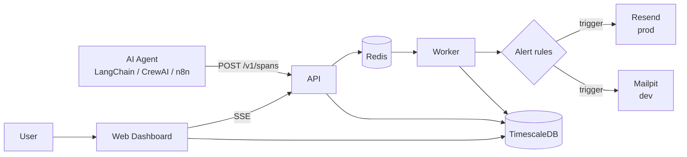

# PAO - Pulse Agent Observe

<!-- Pending capture: add docs/assets/demo.gif after recording the local flow. -->


PAO is a free, self-hosted, privacy-first observability stack for AI agents.
It records agent runs and spans, token usage, cost, errors, and alert events in
your own database.

## Why PAO

- **Private:** trace data stays in infrastructure you control.
- **Self-hosted:** Docker Compose runs the database, queue, services, dashboard,
  and local alert inbox.
- **Free:** PAO is MIT-licensed and has no required external account.

## Quick Start (Self-Hosted)

```bash
git clone https://github.com/<owner>/PAO.git && cd PAO
cp .env.example .env   # then fill in AUTH_SECRET
./start.sh
```

That's it. The full stack comes up:

- Dashboard: http://localhost:3000
- Ingestion API: http://localhost:3001
- Alert inbox (Mailpit): http://localhost:8025
- TimescaleDB: `localhost:5433`

### Requirements

- Docker 24+ with Compose v2
- 4GB RAM minimum
- No external accounts required

## Architecture



<details>
<summary>ASCII architecture for terminals</summary>

```text
AI Agent -- POST /v1/spans --> API --> TimescaleDB
                                  |         ^
                                  v         |
                                Redis --> Worker --> Alert rules
                                                   |        |
                                             Mailpit      Resend

User --> Web Dashboard --> TimescaleDB
                       \--> API SSE stream
```

</details>

## Project layout

```text
apps/api/       Fastify ingestion API and SSE stream
apps/worker/    BullMQ processors and alert evaluation
apps/web/       Next.js dashboard and local auth
packages/db/   Prisma schema, migrations, and client
packages/types Shared TypeScript types
packages/pulse-agent/   Node SDK: @pulse/agent
packages/pulse-agent-py/ Python SDK: pulse-agent
docs/           Operations, architecture, and migration guides
```

## Sending traces

### Node SDK

```ts
import { PulseAgent } from '@pulse/agent'

const pulse = new PulseAgent({
  apiKey: process.env.PULSE_API_KEY!,
  host: 'http://localhost:3001',
})

const run = await pulse.startRun('Summarize quarterly report')
const span = run.startSpan('llm_call', { name: 'completion', model: 'gpt-4o' })
span.end({ inputTokens: 210, outputTokens: 145, costUsd: 0.0053, status: 'success' })
await run.complete({ status: 'completed' })
```

### Python SDK

```python
from pulse_agent import PulseAgent

pulse = PulseAgent(api_key="pk_live_...", base_url="http://localhost:3001")
run = pulse.start_run("Summarize quarterly report")
span = run.start_span("llm_call", model="gpt-4o")
span.end(input_tokens=210, output_tokens=145, cost_usd=0.0053, status="success")
run.complete(status="completed")
```

### curl

```bash
curl -X POST http://localhost:3001/ingest/agent-span \
  -H 'content-type: application/json' \
  -H 'x-api-key: YOUR_PROJECT_KEY' \
  -d '{"runId":"demo-run","spanId":"demo-span","name":"llm_call","type":"llm_call","status":"success"}'
```

Set `PULSE_DISABLED=true` to make either SDK a no-op, for example in tests.

## Alerts

Alert emails use Mailpit locally and are visible at http://localhost:8025.
See the [Mailpit setup guide](docs/mailpit-setup.md) for SMTP configuration.
For production delivery, configure the Resend transport as described in the
[deployment guide](docs/deployment.md).

## Configuration

Copy `.env.example` to `.env` and set the values appropriate for your setup.

| Variable | Purpose | Local value |
| --- | --- | --- |
| `DATABASE_URL` | PostgreSQL/TimescaleDB connection | `...@localhost:5433/pao` |
| `REDIS_URL` | BullMQ Redis connection | `redis://localhost:6380` |
| `AUTH_SECRET` | Session signing secret | generated secret |
| `AUTH_URL` | Auth callback base URL | `http://localhost:3000` |
| `INGESTION_API_URL` | Dashboard API target | `http://localhost:3001` |
| `EMAIL_TRANSPORT` | `smtp` or `resend` | `smtp` |
| `SMTP_HOST` / `SMTP_PORT` | Local SMTP server | `mailpit` / `1025` |
| `SMTP_FROM` | Alert sender in local mode | `alerts@pao.local` |
| `RESEND_API_KEY` | Optional production email key | unset locally |

## Development

```bash
npm install
npm run dev
npm run build
turbo run test
pytest packages/pulse-agent-py/tests
```

To run the stack directly without the startup helper:

```bash
docker compose up -d
```

## Deployment

See [docs/deployment.md](docs/deployment.md) for production notes and
prebuilt GHCR images. See [PAO vs. LangSmith](docs/vs-langsmith.md) for a
fact-based comparison and migration considerations.

## Contributing

Read [CONTRIBUTING.md](CONTRIBUTING.md) before opening a pull request.

## License

PAO is released under the [MIT License](LICENSE).
